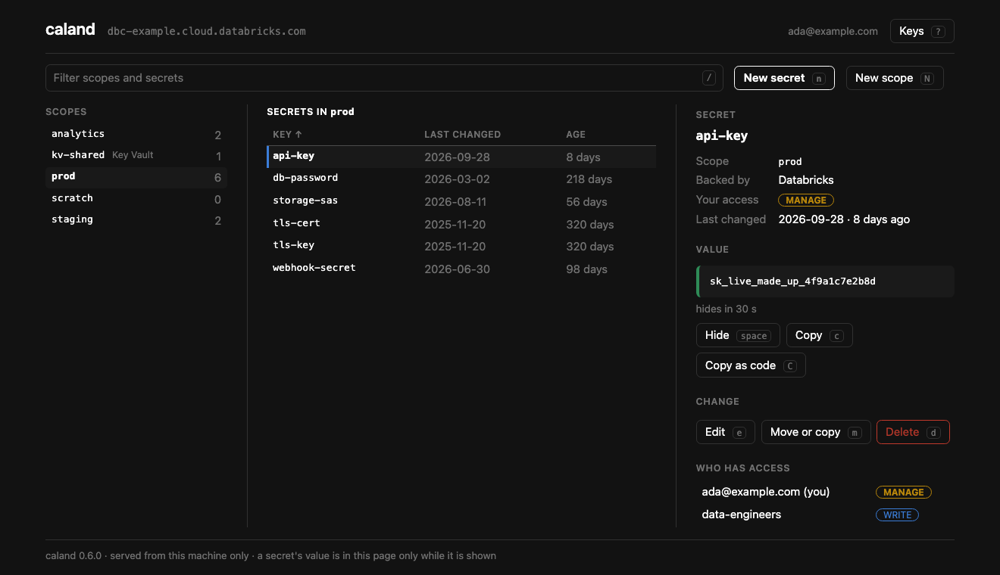
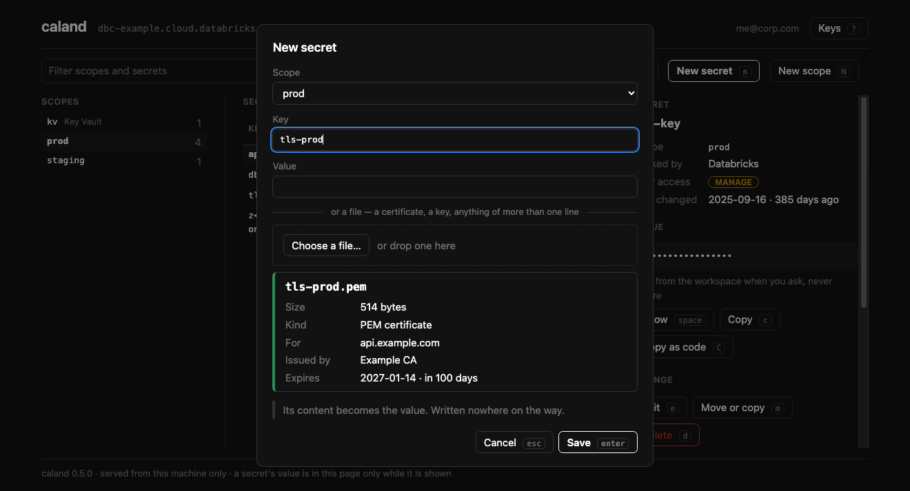

# Caland ▦

**Databricks secrets, by hand: a keyboard-driven page in your browser, served
from your own machine.** Browse scopes, secrets and grants; create, edit, move
and delete; show and copy values; put a certificate in from a file.

[](https://github.com/kostavo-oss/caland/actions/workflows/ci.yml)
[](https://pypi.org/project/caland/)
[](https://pypi.org/project/caland/)
[](https://kostavo-oss.github.io/caland/)
[](LICENSE)
[](https://github.com/astral-sh/ruff)



**[Read the docs →](https://kostavo-oss.github.io/caland/)** — installation,
connecting, every key, and how the page is kept yours.

## Named after

Pieter Caland (1826–1902), the engineer who designed and built the Nieuwe Waterweg — the
cut through the dunes that gave Rotterdam its way to the sea. Like the other Kostavo
tools, Caland carries an engineer's name.

Until 0.6 Caland was a terminal app, and before that it was called `isolinear`. That
terminal app is still on PyPI under that name, as it was, and is a separate tool now —
[if you want a terminal app](https://kostavo-oss.github.io/caland/installation/#if-you-want-a-terminal-app).

## Install

Run it with [uv](https://docs.astral.sh/uv/) — no clone, no virtualenv:

```sh
uvx caland              # run once, ephemerally
uv tool install caland  # install the `caland` command on PATH
```

Or with pipx: `pipx run caland` / `pipx install caland`.

> Requires Python ≥ 3.11 and a browser. Built on the
> [Databricks SDK](https://github.com/databricks/databricks-sdk-py).

## Quickstart

```sh
caland
```

It starts a small server on your machine and opens a tab. You **don't** need to set
anything up: Caland finds the workspaces it can reach, and when there is no doubt which
one you mean — the workspace of a bundle in the current folder, or your only profile — it
goes straight there. Otherwise the page asks:

1. **A bundle** — the workspace of a `databricks.yml` in the current folder, picked for you.
2. **`~/.databrickscfg`** — every profile.
3. **An address** — sign in through the browser, as `databricks auth login` does. No
   token; keep it as a profile if you want to come back by name.

```sh
caland prod               # straight to a workspace by name
caland prod --read-only   # and change nothing there
caland --no-open          # print the link instead of opening a browser
```

<kbd>Ctrl</kbd>+<kbd>C</kbd> stops it and forgets every value it held.

## What it does

- **Three panes** — scopes, the secrets of one with when each was last changed, and the
  detail: your access, who else has a grant, and the value once you ask for it.
- **Secrets, with a way back** — new, edit, move, copy, rename, delete. Nothing is deleted
  without a `y`, and `u` puts the last one back.
- **Files as they are** — choose a certificate with your system's file dialog. Caland says
  who it is for and when it expires before it is saved, and stores it byte for byte.
- **Grants** — who has access to a scope; what you can reach; what somebody else can.
- **`.env` in and out**, and a report of the secrets nobody has changed in a while.
- **A value is shown when asked, and hides itself after 30 seconds.**



## Keys

Everything has a key, and everything can be clicked. `?` on the page lists them all.

| Keys | |
|------|--|
| <kbd>Tab</kbd> · <kbd>←</kbd> <kbd>→</kbd> | From pane to pane |
| <kbd>↑</kbd> <kbd>↓</kbd> · <kbd>j</kbd> <kbd>k</kbd> | Inside a pane |
| <kbd>/</kbd> | Filter scopes and secrets |
| <kbd>Space</kbd> · <kbd>c</kbd> · <kbd>C</kbd> | Show the value · copy it · copy how to reach it from code |
| <kbd>n</kbd> · <kbd>e</kbd> · <kbd>m</kbd> · <kbd>d</kbd> · <kbd>u</kbd> | New · edit · move or copy · delete · put back |
| <kbd>N</kbd> · <kbd>D</kbd> | New scope · delete scope |
| <kbd>p</kbd> · <kbd>a</kbd> · <kbd>P</kbd> | Grants of the scope · what you can reach · what somebody else can |
| <kbd>i</kbd> · <kbd>x</kbd> · <kbd>A</kbd> | `.env` in · `.env` out · secrets gone stale |
| <kbd>s</kbd> · <kbd>S</kbd> · <kbd>f</kbd> | Sort · the other way round · all scopes or only yours |
| <kbd>w</kbd> | Another workspace |

## Security

- **A value is read from the workspace each time you ask for it, and written nowhere**:
  not to disk, not to a log. Shown, it hides itself after 30 seconds.
- **The page is yours only.** It is served from `127.0.0.1`, answers only to its own page
  at its own address, and to nothing without the session's key — which is never a cookie
  and never on a command line.
- **Nothing is deleted without a `y`**, and `--read-only` changes nothing in the workspace.
  On your own machine it may still write what it always may: your two preferences, and a
  profile if you sign in to an address and ask to keep it.
- **No credentials of its own.** It signs in the way the Databricks CLI does. A profile it
  saves holds an address and how to sign in, never a token.

More, and what it cannot defend against, in
[the docs](https://kostavo-oss.github.io/caland/page/#how-it-is-kept-yours).

## How it's built

Hexagonal / DDD layers; dependencies point inward and **all I/O is behind domain
ports**, so the UI never touches the SDK and the whole domain is unit-testable
without a network:

```
caland/
  domain/          model, rules + ports (SecretStore, WorkspaceConnector, ProfileStore,
                   BundleStore, SettingsStore)
  application/     use-cases (WorkspaceService, OnboardingService) + read model
  infrastructure/  adapters — the only Databricks-SDK importers
  interface/web/   the page: a server on this machine, and what it serves
  app.py           the command
```

## Contributing

Issues and PRs welcome — see [CONTRIBUTING.md](CONTRIBUTING.md). The toolkit is
all-[Astral](https://astral.sh): **uv** (env/deps/run), **ruff** (lint+format),
**ty** (types).

```sh
uv sync
uv run pytest        # tests (units, the server over HTTP, the page in Chrome)
uv run ruff check .  # lint
uv run ty check      # types
uv run caland     # run it

uv run --group docs mkdocs serve   # preview the docs site at localhost:8000
```

## Where it fits

> **Terraform for your platform, Asset Bundles for your code, stevin for your data model.**

Caland is one of the [Kostavo tools](https://github.com/kostavo-oss) for Databricks.
Each does one job and none needs another: this one is for the secrets a deploy and a
data model both end up depending on, and for the people who have to look after them.

Community project, not affiliated with or endorsed by Databricks.

## License

Apache-2.0 — see [LICENSE](LICENSE).
