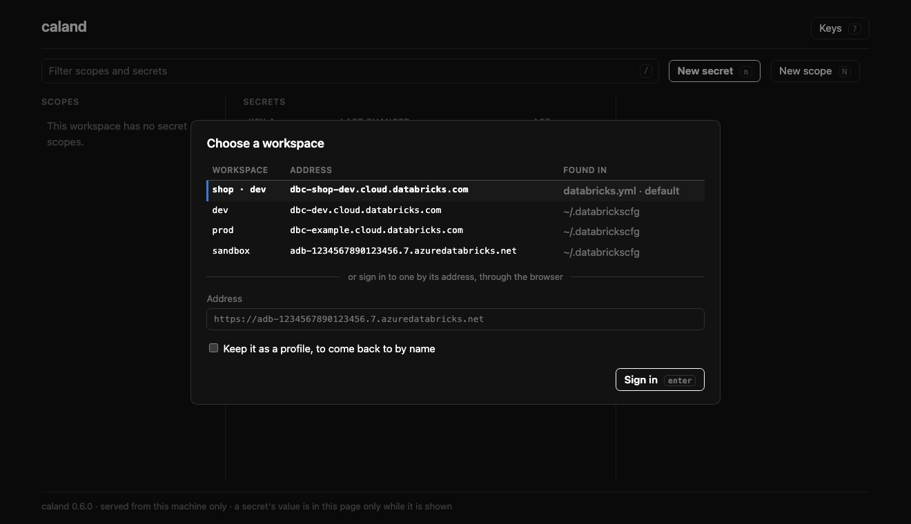

# Connecting

You don't set anything up. Caland finds the workspaces it can reach, and when there is no
doubt which one you mean it goes straight there: the workspace of a bundle in the current
folder, or your only profile. Otherwise the page asks.



Every row says where it was found. ++up++ ++down++ or ++j++ ++k++ pick, ++enter++ goes
there. A profile connects at once; a bundle's workspace, or an address, signs you in through
the browser, as `databricks auth login` does. No token is asked for.

To go straight to one, name it:

```sh
caland prod               # a profile, or a bundle's target
caland --profile prod     # the same
caland prod --read-only   # and change nothing there
```

A name that is not there is said, with the names that are, and nothing starts.

On the page, ++w++ opens the choice again. Going to another workspace leaves nothing of the
one you were in: not on the page, and not in Caland's memory.

## Where workspaces are found

### 1. Asset bundle

If a `databricks.yml` (a [Databricks Asset Bundle](https://docs.databricks.com/dev-tools/bundles/index.html)) is present in the current directory, its target workspace is offered as the **pre-selected default**.

Caland resolves the host as follows:

- It picks the target flagged `default: true` (or the only target, if there is just one).
- It falls back to the top-level `workspace.host`.
- Unresolved `${...}` variables are skipped, falling back to the top-level host.

A minimal bundle with `dev` and `prod` targets, where `prod` is the default:

```yaml
bundle:
  name: my-project

targets:
  dev:
    workspace:
      host: https://dev.cloud.databricks.com

  prod:
    default: true
    workspace:
      host: https://prod.cloud.databricks.com
```

!!! tip "Running inside a bundle project just works"
    Launch `caland` from a directory that contains a `databricks.yml` and the right workspace is already selected — just press ++enter++.

### 2. `~/.databrickscfg` profiles

Every saved profile in `~/.databrickscfg` is listed automatically. Saved profiles connect instantly, because authentication is already configured.

A profile is listed whatever its address: two profiles for one workspace — yours and a
service principal's, say — are two rows, and so is a profile for the workspace of the
bundle you are in. Each signs in its own way. `caland NAME` means the profile of that name;
the bundle's target is where Caland goes when you name nothing.

### 3. An address

Type a workspace's address into the field under the list and press ++enter++: you are
signed in through the browser. An address is `https`, a host, and nothing after it.

Tick *keep it as a profile* and give it a name to come back to it by. What is written to
`~/.databrickscfg` is the address and that you sign in through the browser — no token. The
name has to be a new one: a profile that is there keeps its own way of signing in, and
Caland will not point it at another address.

### With no profile: `DATABRICKS_HOST`

When `~/.databrickscfg` has no profile with an address — or is not there at all — and
`DATABRICKS_HOST` is set, that address is offered, under the name `DEFAULT`. How you are
signed in there is the Databricks SDK's to work out, from what else the environment holds.
It is listed as a profile, since that is how Caland asks the SDK for it.

`DATABRICKS_CONFIG_FILE` names another file than `~/.databrickscfg`, for Caland as for the
Databricks SDK it signs in with: profiles are read from it, and one you keep is written to
it.

## When nothing is found

With no bundle here, no profile and no `DATABRICKS_HOST`, the list is empty and the field
for an address is all there is. Sign in to one, keep it as a profile, and the next time it is on the list.
