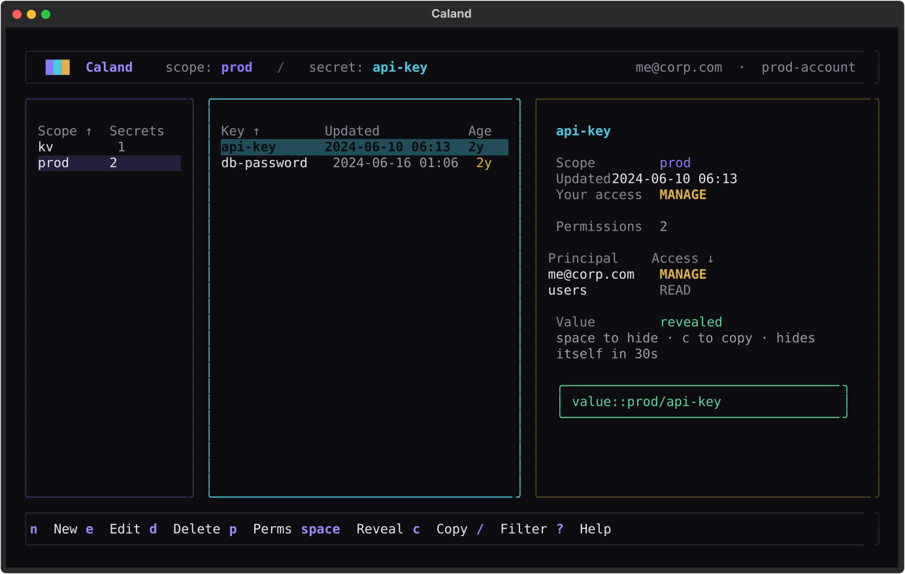

# Caland

A fast, keyboard-driven terminal UI for managing Databricks secrets — browse scopes, secrets, and permissions across three panes without ever leaving your terminal.



Caland puts the full lifecycle of Databricks secret **scopes**, **secrets**, and **ACLs** behind a calm, three-pane browser. Drill from scopes into their secrets, reveal and copy values on demand, and review your effective access — all driven by the keyboard.

## Highlights

- **Three-pane browser** — scopes, secrets, and a rich detail pane (identity, your access, the full ACL list, and the revealed value).
- **Global search** — ++ctrl+f++ fuzzy-matches `scope/key` across the whole workspace and jumps straight to the secret.
- **Full CRUD with undo** — create, edit, move/copy/rename, and delete secrets and scopes, with confirmation on destructive actions and ++u++ to restore.
- **Bulk .env import/export** — load a scope from a `.env` file; export keys (or values, clipboard-only) back out.
- **Permissions / ACLs** — grant, change, or remove READ / WRITE / MANAGE, plus a **who-has-access** lookup for any principal.
- **Lazy reveal, short-lived** — values are fetched only when you reveal or copy them, never bulk-loaded, and a revealed value hides itself after 30 seconds.
- **Copy as code** — ++shift+c++ copies a `dbutils.secrets.get(...)`, Spark-conf, or CLI reference for notebooks and job specs.
- **Authorization overview & stale-secret audit** — one-key views of your effective permission on every scope, and of every secret overdue for rotation.
- **Keyboard-first** — vim and arrow navigation, fuzzy filtering, sortable tables, and a command palette; preferences persist across sessions.
- **Direct connect & read-only mode** — `caland prod --read-only` drops you into a workspace with every mutation disabled.
- **No pre-configuration** — connect by Databricks Asset Bundle, `~/.databrickscfg` profile, or workspace URL (OAuth).

## Quick start

!!! warning "Not on PyPI under this name yet"
    The first release as `caland` is being prepared. Until this notice is gone, do not
    install a `caland` from PyPI — it is not ours. Install from GitHub instead:

    ```sh
    uv tool install git+https://github.com/kostavo-oss/caland
    ```

    Or stay on `isolinear`, the same tool under the name it was last released with.

=== "uvx"

    ```sh
    uvx caland
    ```

=== "uv tool"

    ```sh
    uv tool install caland
    caland
    ```

On launch, Caland opens a workspace picker that discovers connection targets automatically. Pick one, press ++enter++, and you're in.

## Next steps

- [Installation](installation.md) — install with uvx, uv tool, or pipx.
- [Connecting](connecting.md) — the workspace picker and its three sources.
- [Browsing & managing](browsing.md) — navigate, reveal, and manage secrets and permissions.

---

Caland is named after Pieter Caland (1826–1902), the engineer who designed and built the
Nieuwe Waterweg, the cut through the dunes that gave Rotterdam its way to the sea.

Community project, not affiliated with or endorsed by Databricks.
