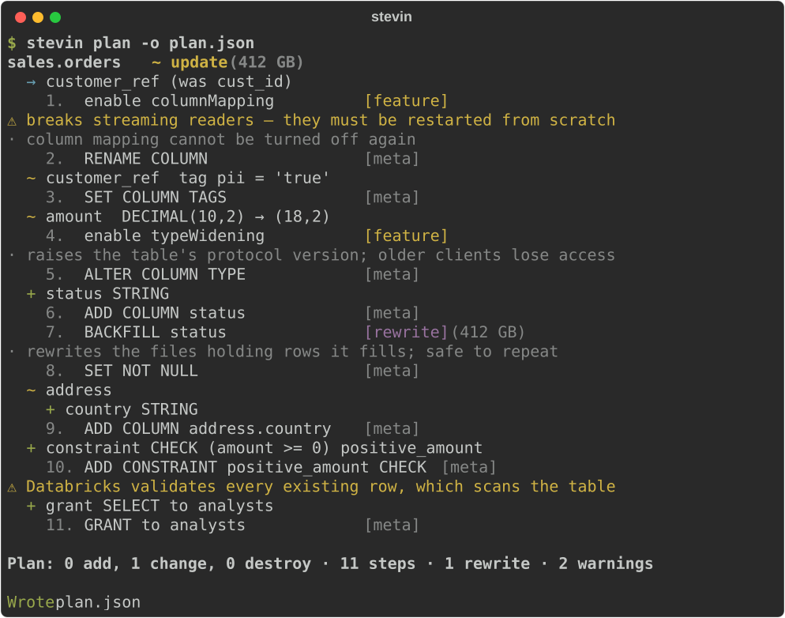

# stevin

**stevin puts in place the tables and access that your transformation tool doesn't own.**
Safe plan/apply migrations for Unity Catalog tables and schemas.

!!! warning "Alpha"
    Every milestone in the design is built, and the assumptions stevin makes about
    Databricks are checked by a live test suite against a real workspace — see
    [testing](testing.md). It is still an alpha: try it on dev before production, and
    expect the spec format to change before the first stable release.

Every workspace has tables that nobody's pipeline owns: the table a notebook appends
to, the lookup table, the table another system writes into. Someone made each once, with
a `CREATE TABLE` in a notebook, and changing one is another notebook, run by hand, once
per environment. stevin keeps those tables, and the access around them, as specs in git.

Describe the tables you want in YAML or SQL, or take their shape from a data contract;
diff that against live Unity Catalog, review a plan, then apply it. stevin knows which Delta changes are metadata-only, which need
a table feature enabled first, and which force a rewrite — and it says so before it
touches anything.

[Get started](getting-started.md){ .md-button .md-button--primary }
[Take the tour](tour.md){ .md-button }
[See every feature](features.md){ .md-button }

## Highlights

- **The tables and access your transformation tool doesn't own** — dbt, Lakeflow or
  SQLMesh own what they build. stevin puts in place what they read and what a setup
  job used to: the tables notebooks and external systems write into, lookup tables,
  filtered views, grants, column masks and row filters. It never touches what another
  tool built.
- **A plan you can actually read** — per table, per column, nested struct changes as a
  tree, numbered steps, risk labels, and size hints on anything that rewrites.
- **Delta-aware planning** — metadata-only vs. table-feature vs. rewrite is a
  classification the planner makes explicit, not a surprise at apply time.
- **Safe by default** — only tables stevin manages can ever be drop candidates.
  Everything else is reported as unmanaged and left alone; destructive steps need
  `--allow-destructive`.
- **No state file** — Unity Catalog *is* the state. Nothing to sync, nothing to corrupt.
- **Nested types are first class** — struct, array and map fields diff by path
  (`address.element.zip`), with per-field comments and renames.
- **Built for CI** — a `drift` command with a non-zero exit code, a Markdown renderer
  for PR comments, and JSON for anything else.
- **Fits your stack** — Python-native, Apache-2.0, and at home next to a
  [Databricks Asset Bundle](bundles.md): it reads your bundle's targets, variables and
  schemas, and leaves what the bundle declares to the bundle.

## Next steps

- [Get started](getting-started.md) — your own workspace: install, import, plan, apply.
- [A tour](tour.md) — one project from nothing to a reviewed pull request, in ten minutes.
- [With an Asset Bundle](bundles.md) — if your project already has a `databricks.yml`.
- [Feature gallery](features.md) — every kind of change, with its spec and its plan.
- [Installation](installation.md) — install with uvx, uv tool, or pipx.
- [Writing a spec](spec.md) — the YAML format, types, and renames.
- [Commands](cli.md) — `validate`, `import`, `plan`, `apply`, `drift`.
- [Safety model](safety.md) — ownership, risk classes, and what stevin refuses to do.
- [Next to other tools](next-to-other-tools.md) — where dbt, dlt, Lakeflow, the bundle
  and Terraform stop, and stevin starts.
- [Access recipes](access-recipes.md) — groups per schema, rows by region, PII by tag;
  and what stays hard.
- [Running from a job](running-from-a-job.md) — when CI can't reach the workspace.

## Where it fits

stevin is one of the [Kostavo tools](https://kostavo-oss.github.io/tools/): small tools
for the ugly gaps on Databricks, one gap each. Its gap is the table nobody's pipeline
owns, and who may see it. Each works alone.
[Why the tools exist](https://kostavo-oss.github.io/tools/why/) has the rules they keep,
and the README says
[what stevin will not do](https://github.com/kostavo-oss/tools/tree/main/packages/stevin#what-it-will-not-do)
and when you no longer need it.

---

stevin is named after Simon Stevin (1548–1620), engineer and mathematician, who designed
sluices and introduced decimal notation. Precision before action.

Community project, not affiliated with or endorsed by Databricks.
