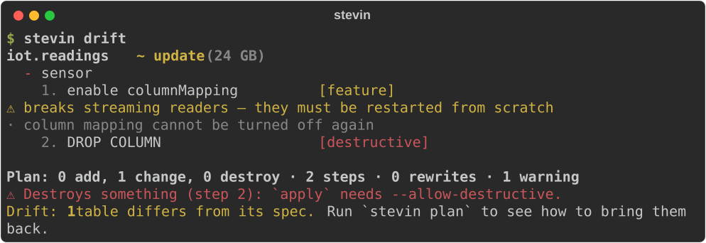
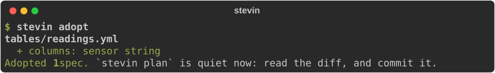
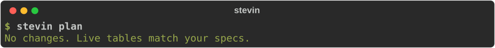

# Tables your notebooks write

A notebook appends to a table every night. Somebody made that table once, by hand, and
nobody knows what it should look like any more. stevin keeps its shape and its access in
a spec, and the notebook keeps writing to it.

The notebook may change the table. This page is the loop that keeps the spec true when
it does:

1. A spec **declares** the table, and stevin creates it.
2. The notebook **writes** to it, and sometimes adds a column.
3. `stevin drift` **shows** the change, every night.
4. `stevin adopt` **puts it into the spec**, as a diff to review.

A change someone wants to make on purpose goes the other way: a spec change, and a
reviewed plan.

## 1. Declare the table

```yaml title="tables/readings.yml"
--8<-- "assets/screens/notebook-readings.yml"
```

`stevin apply` creates the table with its key, its clustering and its grant, and marks
it as stevin's. The notebook no longer needs a `CREATE TABLE IF NOT EXISTS` cell, and
the grant no longer needs a setup notebook.

## 2. The notebook writes

The notebook is unchanged. It appends, and one day the source has a field the table
doesn't:

```python
readings = spark.read.json("/Volumes/dev/iot/landing/")

(
    readings.write.mode("append")
    .option("mergeSchema", "true")
    .saveAsTable("dev.iot.readings")
)
```

With `mergeSchema`, Delta adds the column the table lacks: nullable, at the end
([schema evolution](https://docs.databricks.com/aws/en/delta/update-schema)). The write
succeeds. The table now has a column the spec doesn't mention.

That is allowed. stevin does not run in the notebook and does not stand between the
notebook and the table.

## 3. Drift shows it

`drift` compares the live tables with the specs. It exits with `0` when they match and
with `2` when they differ, so a [nightly job](ci.md#catch-drift-nightly) fails on the
morning after the notebook's change.



Drift is printed as a plan: what `apply` would do to make the table match the spec
again. Here that is dropping the new column. Nobody has to run that plan, and `apply`
refuses the drop without `--allow-destructive`. The rows the notebook wrote are not
drift: stevin compares shape and access, never data.

## 4. Adopt puts it into the spec

The column was usually wanted. `adopt` writes it into the spec file that already
describes the table. No table is touched.



```yaml title="tables/readings.yml — after adopting" hl_lines="16"
--8<-- "assets/screens/notebook-adopted.yml"
```

The file is edited, not rewritten: the comments, the `${catalog}` and the layout are
as they were. The result is a git diff. Open a pull request with it, and the review
that would have happened before the change happens after it. Once it is merged, the
plan is empty:



A column that was not wanted is a conversation with the notebook's author first. Then
the plan from step 3 removes it, with `--allow-destructive`.

[`adopt` →](cli.md#adopt) lists what it takes from the workspace and what it leaves
alone.

## A change made on purpose

A new clustering key, a tag, a grant for another team, a wider type: these start in the
spec.

1. Edit the spec, and open a pull request.
2. The [Action](ci.md) comments the plan: which steps are free, which rewrite the table,
   which destroy something.
3. On merge, `stevin apply` runs the reviewed plan.

A column the notebook is going to write can be added the same way, before the notebook
writes it. Then the write needs no `mergeSchema`, and there is no drift the next
morning.

While a notebook is being developed, it should write to a table of its own. Every
target has its own `${catalog}`, and a bundle's development target gives each developer
their own schema names:
[Development mode](bundles.md#development-mode-and-other-renaming).

## When the notebook owns the shape

Some teams want the notebook to decide the columns, and only want the access kept in
git. Name the table in `owned_elsewhere`, and write a
[governance-only spec](spec.md#a-governance-only-spec): tags, grants, masks, a row
filter and an owner, with no column types. stevin then never creates, reshapes or drops
the table, and a new column is not drift.

## What stevin does not do

- **It does not run in the notebook.** There is no notebook entry point. stevin applies
  from CI, or [as a job task](running-from-a-job.md) where CI can't reach the workspace.
- **It does not load data.** The notebook writes the rows. stevin never reads them,
  moves them or checks them, except in a rewrite that a reviewed plan asked for.
- **It does not stop a write.** A notebook with `MODIFY` on the table can change it.
  stevin reports the change the next time `drift` runs, and not before.
- **It does not adopt by itself.** `adopt` is a command a person runs, and its result is
  a diff a person reads.

## How this is tested

The pictures on this page are stevin's own output, made by `tests/screens.py` against
the fake warehouse.

`tests/integration/test_live_notebook_tables.py` runs the same loop against a real
workspace: create the table from the spec, write to it, add a column, read the drift,
adopt, and plan again. It then checks that the rows are still there and that the table
still carries stevin's marker. That test simulates the notebook through a SQL warehouse:
an `INSERT`, and an `ALTER TABLE … ADD COLUMNS`, which is what an append with
`mergeSchema` leaves behind. It does not run PySpark, and it does not cover a write
that replaces the table's schema (`overwriteSchema`).
